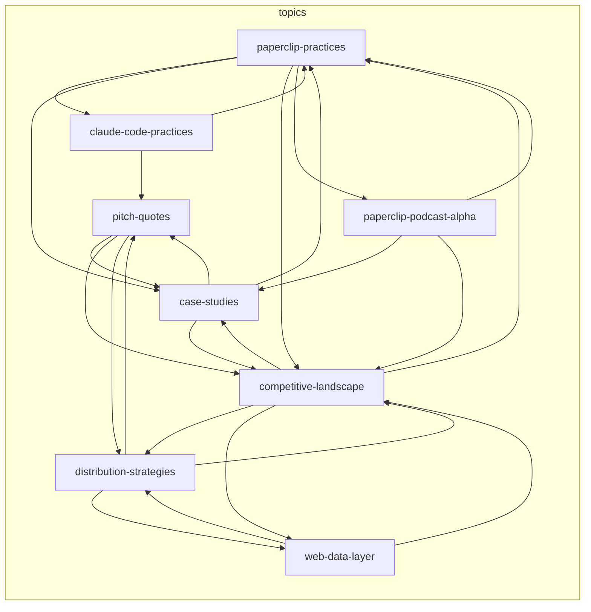

# Knowledge Catalog

> Auto-maintained concept map. Nodes = articles. Edges = cross-references.
> Last updated: 2026-04-06 by Hermes.

## Relationship Summary

| Article | Links Out | Links In |
|---------|-----------|----------|
| paperclip-practices | 4 | 3 |
| claude-code-practices | 2 | 1 |
| distribution-strategies | 3 | 2 |
| web-data-layer | 2 | 2 |
| competitive-landscape | 4 | 4 |
| case-studies | 3 | 3 |
| pitch-quotes | 3 | 3 |
| paperclip-podcast-alpha | 3 | 1 |

## Subgraphs

_Concept and project nodes will appear here as Hermes compiles them._
