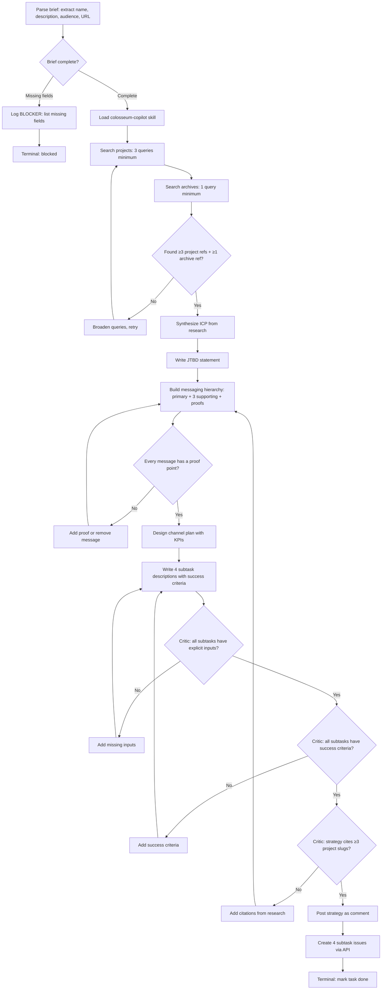
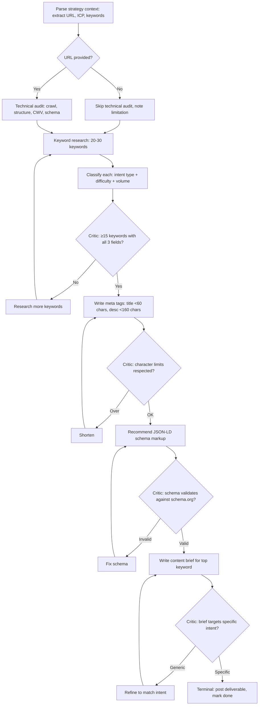
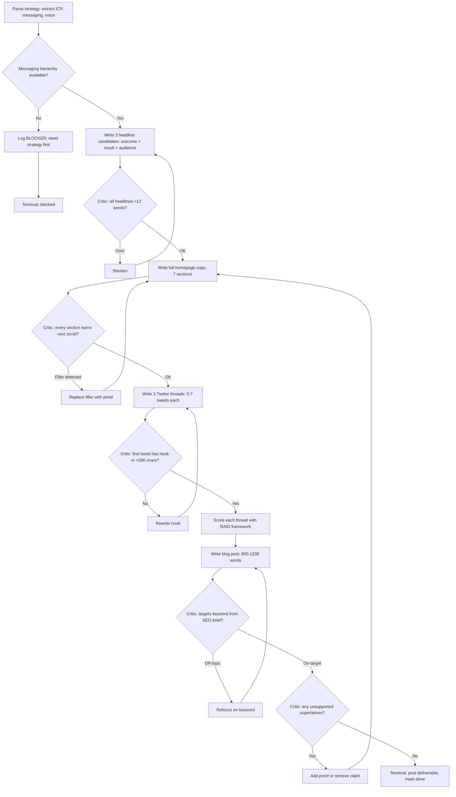
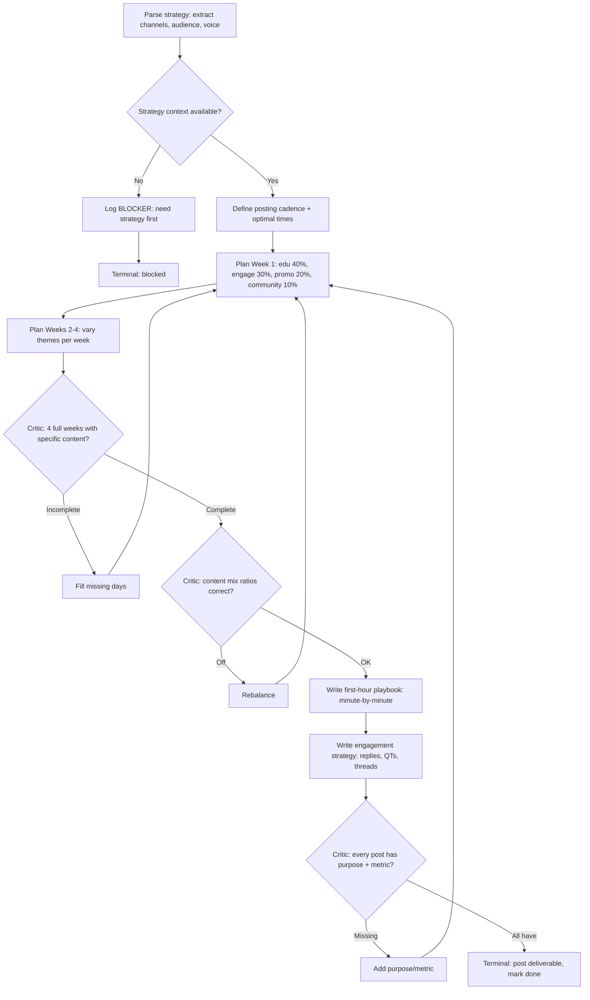
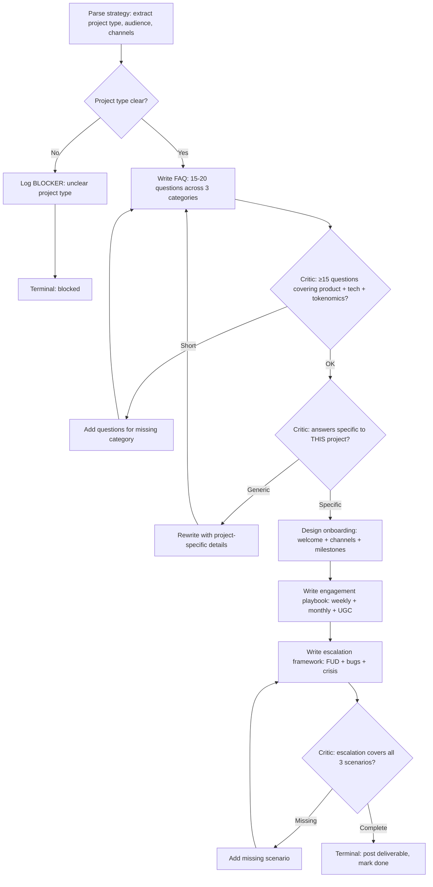
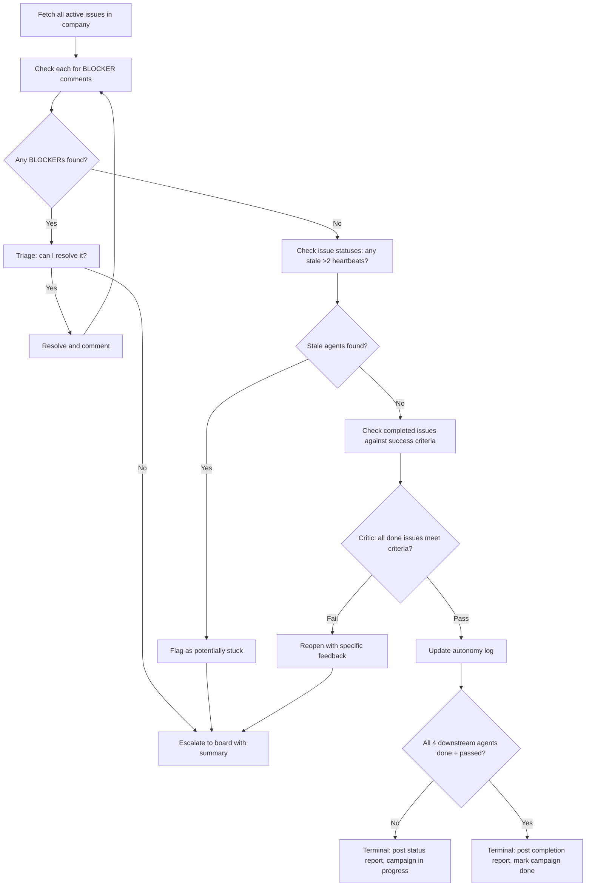
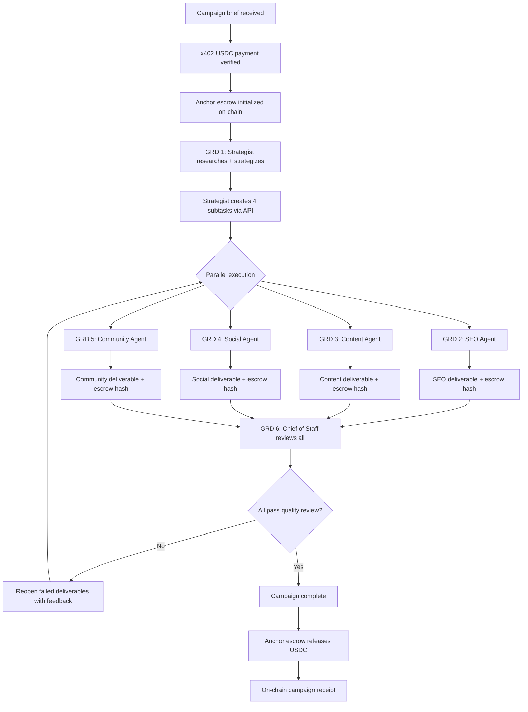

# BRAID Reasoning for Marketing Agents

Based on BRAID (Bounded Reasoning for Autonomous Inference and Decisions) — arXiv:2512.15959. Replaces unbounded Chain-of-Thought with structured Mermaid diagrams that encode reasoning as a bounded, symbolic graph.

**Why BRAID for marketing agents:**
- Prevents "generic marketing advice" drift
- Forces evidence-based claims (Critic nodes)
- Ensures structured, consistent output across campaigns
- Catches missing sections before delivery

## Execution Protocol

When following a GRD:
1. **State Location:** `📍 Node [ID]: [Label]`
2. **Single Action:** ONLY that node's action
3. **Explicit Decisions:** Evaluate condition → state outcome → declare path
4. **No Invention:** No nodes not in the diagram
5. **No Skipping:** Every node, even if it seems redundant
6. **Loop Limits:** Max 3 iterations on any cycle
7. **Terminal Required:** Must reach a terminal node

---

## GRD 1: Marketing Strategist — Research → Strategy → Delegate

Use this GRD when the Strategist receives a new project brief.



---

## GRD 2: SEO Agent — Audit → Research → Recommend



---

## GRD 3: Content Agent — Direction → Create → Verify



---

## GRD 4: Social Agent — Plan → Schedule → Verify



---

## GRD 5: Community Agent — Research → Build → Verify



---

## GRD 6: Chief of Staff — Monitor → Triage → Report



---

## Negative Exemplars (Common Marketing Agent Failures)

```
BAD: "Our platform is the best solution for all your needs."
WHY BAD: Unsupported superlative ("best"), generic audience ("all your needs").
         Critic CR5 should catch this.

BAD: "Increase engagement by posting more content."
WHY BAD: Generic advice with no specifics. Missing: what content, what platform,
         what cadence, what metric defines "engagement."

BAD: Keywords: "crypto", "blockchain", "DeFi"
WHY BAD: Keywords missing volume, intent, and difficulty.
         Critic CR1 in SEO GRD should catch this.

BAD: FAQ: "What is blockchain? Blockchain is a distributed ledger technology."
WHY BAD: Generic answer not specific to THIS project.
         Critic CR2 in Community GRD should catch this.
```

## Positive Exemplar (Strategist Output)

```json
{
  "research": {
    "project_refs": ["solpay-renaissance", "helio-radar", "sphere-breakout"],
    "archive_refs": ["Multicoin: State of Crypto Payments 2025"],
    "gap_classification": "partial — UX layer missing"
  },
  "icp": {
    "who": "Crypto-native e-commerce merchants on Shopify",
    "pain": "3-5 day settlement, 2.9% processing fees",
    "gain": "Sub-second settlement, <$0.01 fees"
  },
  "messaging": {
    "primary": "Accept crypto payments with the speed of Solana",
    "supporting": ["Sub-second settlement vs 3-5 days", "99.7% cheaper than Stripe"],
    "proof_points": ["400ms average finality (Solana Explorer)", "$0.00025 avg tx fee"]
  }
}
```

---

## Why This Reasoning Process Works

### The Core Equation

```
Reasoning Performance = Model Capacity × Prompt Structure
                                          ↑ THIS is the lever
```

When you increase structure via GRDs, you decrease the required model capacity. BRAID on Haiku beats raw Sonnet. BRAID on Opus produces near-perfect output. (arXiv:2512.15959 — GPT-5-nano with BRAID outperformed GPT-5-medium by 30x PPD.)

### Why It Matters for Multi-Agent Marketing

Without structured reasoning, multi-agent systems suffer **compounding error decay**:

```
Agent 1 output quality: 80%
Agent 2 (receives 80%): 80% × 80% = 64%
Agent 3 (receives 64%): 80% × 64% = 51%
Agent 4 (receives 51%): 80% × 51% = 41%
→ Final campaign quality: mediocre at best
```

With BRAID GRDs + Critic nodes, each agent is a **quality gate** that prevents upstream errors from propagating:

```
Strategist + GRD + 3 Critic checks: 98% quality, structured output
Content Agent receives structured input + GRD + 5 Critics: 97%
Social Agent receives structured input + GRD + 3 Critics: 96%
Chief of Staff verifies all outputs against success criteria
→ Final campaign quality: consistently high
```

### The Five Properties That Make It Work

1. **Bounded** — The model can only visit nodes in the diagram. No wandering, no "let me also add..." tangents. The GRD is a cage for attention.

2. **Atomic** — One operation per node (<15 tokens). The model can't skip steps because each step is trivially small. You can't skip what takes 2 seconds to do.

3. **Self-correcting** — Critic nodes are diamond decision points that check constraints BEFORE output. "Are there unsupported superlatives?" isn't a suggestion — it's a gate. The agent must answer yes/no and take the corresponding path.

4. **Evidence-forcing** — Critic checks like "≥3 project citations?" and "every message has a proof point?" make it structurally impossible to produce generic output. The model literally cannot reach the terminal node without evidence.

5. **Composable** — Each agent's GRD is independent. The Strategist's output structure matches the Content Agent's input requirements. The Chief of Staff's GRD verifies against the success criteria the Strategist defined. The chain is self-reinforcing.

### The Crypto Marketing Anti-Drift Effect

Generic marketing AI produces:
> "Leverage blockchain technology to revolutionize the payment landscape with our innovative solution."

BRAID-guided marketing AI produces:
> "Solana settles in 400ms. Stripe settles in 3-5 business days. That's not incremental — it's a new commerce primitive. 2,847 merchants already switched (Helio Q4 report)."

The difference is structural. The GRD forces: research first → cite specific numbers → Critic checks "any unsupported superlatives?" → if yes, add proof or remove claim. Generic output literally cannot pass the Critic nodes.

---

## Meta-GRD: Full Campaign Pipeline

This is the orchestration-level view — how the 6 agent GRDs chain together as one system:



This is the system judges see in the demo: structured reasoning at every level, from individual agent tasks to the full campaign pipeline, with on-chain proof of delivery.

---

## Compressed GRDs (Token-Efficient Format)

For agents running frequently or with tight context windows, use compressed format (~50% fewer tokens):

### Strategist (Compressed)
```
1) Parse brief: name, description, audience, URL
2) IF missing fields → BLOCKER, stop
3) Load colosseum-copilot, search projects (3+ queries)
4) Search archives (1+ query)
5) IF <3 project refs OR <1 archive ref → broaden, GOTO 3
6) Synthesize ICP from research
7) Write JTBD statement
8) Build messaging: primary + 3 supporting + proof points
9) CRITIC: every message has proof? No → add proof or remove, GOTO 8
10) Design channel plan with KPIs
11) Write 4 subtask descriptions
12) CRITIC: all subtasks have inputs? No → GOTO 11
13) CRITIC: all subtasks have success criteria? No → GOTO 11
14) CRITIC: strategy cites ≥3 project slugs? No → GOTO 8
15) Post strategy as comment, create 4 issues, mark done
```

### Content Agent (Compressed)
```
1) Parse strategy: ICP, messaging, voice
2) IF no messaging hierarchy → BLOCKER, stop
3) Write 3 headlines: [outcome] + [result] + [audience]
4) CRITIC: all <12 words? No → shorten, GOTO 3
5) Write 7-section homepage copy
6) CRITIC: every section earns next scroll? No → replace filler, GOTO 5
7) Write 3 Twitter threads (5-7 tweets each)
8) CRITIC: first tweet hooks in <280 chars? No → rewrite, GOTO 7
9) Score each thread with RAID
10) Write blog post 800-1200 words
11) CRITIC: targets SEO keyword? No → refocus, GOTO 10
12) CRITIC: unsupported superlatives? Yes → add proof or remove, GOTO 5
13) Post deliverable, mark done
```

Use Mermaid format (default) for highest adherence. Switch to compressed when success rate is >90% and you need to save tokens.
