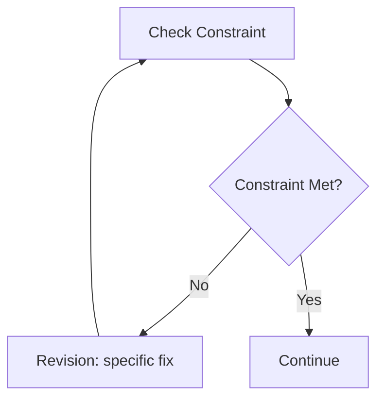
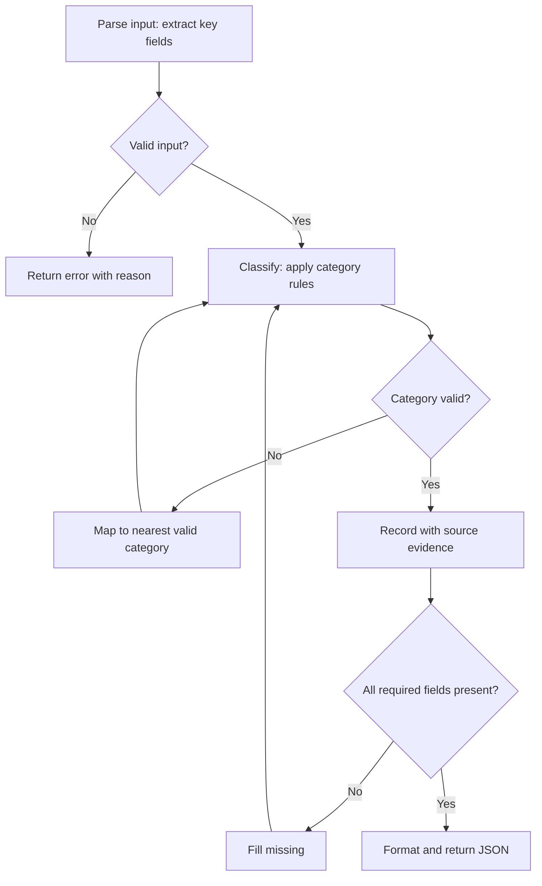
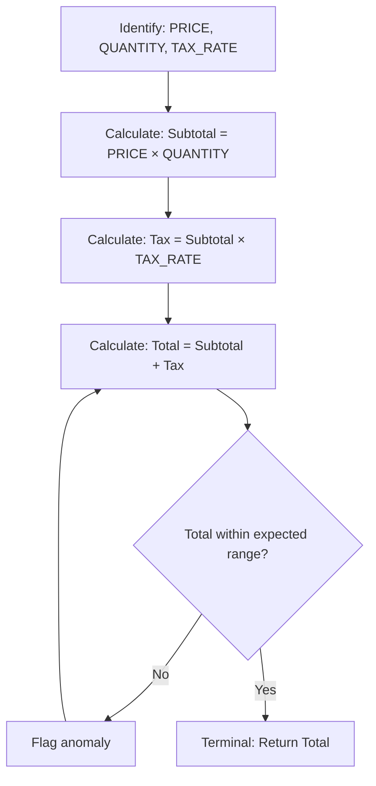
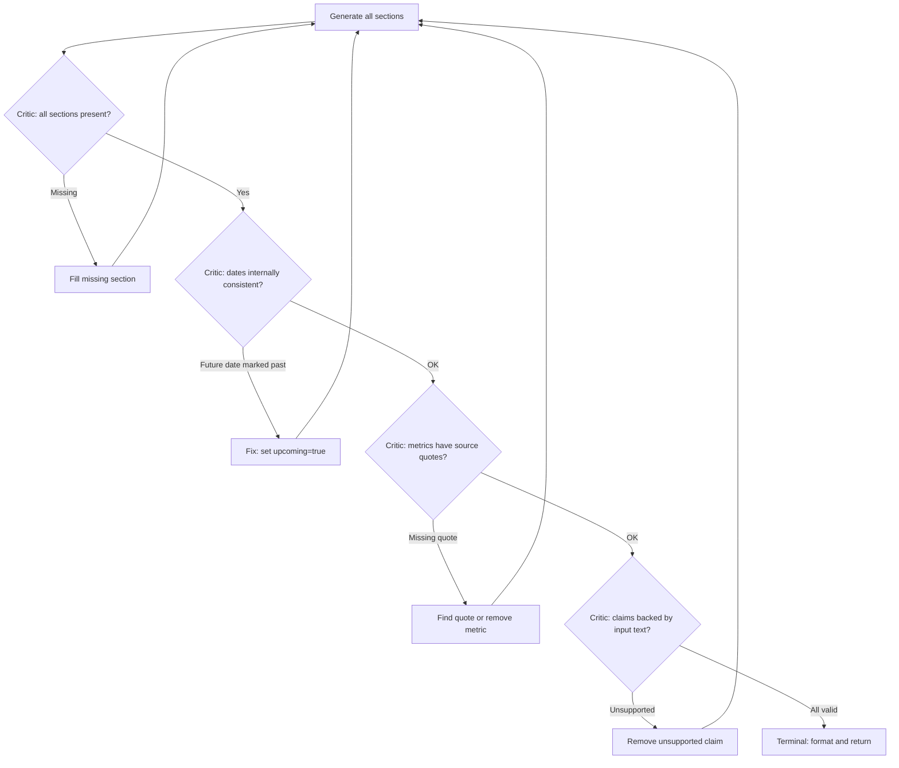
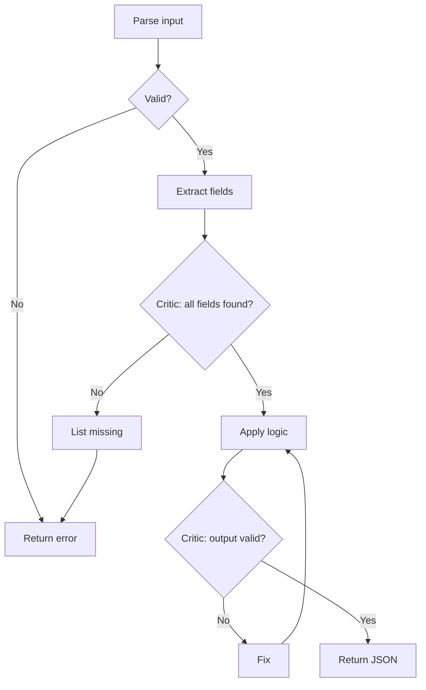

# BRAID Reasoning Framework

> **COGNITIVE INTEGRITY PROTOCOL v2.3**
> This skill follows the Cognitive Integrity Protocol. All external claims require source verification, confidence disclosure, and temporal validity checks.
> Reference: `Claude-skills/COGNITIVE-INTEGRITY-PROTOCOL.md`

---

## Critical: Execution Protocol

When executing a BRAID diagram, follow these rules exactly:

1. **State Location:** `📍 Node [ID]: [Label]`
2. **Single Action:** ONLY that node's action
3. **Explicit Decisions:** Evaluate condition → state outcome → declare path
4. **No Invention:** No nodes not in the diagram
5. **No Skipping:** Every node, even if it seems redundant
6. **Loop Limits:** Max 3 iterations on any cycle
7. **Terminal Required:** Must reach a terminal node

---

**Bounded Reasoning for Autonomous Inference and Decisions** (arXiv:2512.15959, Amcalar & Cinar, OpenServ Labs)

BRAID replaces unbounded Chain-of-Thought with structured Mermaid diagrams (Guided Reasoning Diagrams) that encode reasoning as a bounded, symbolic graph. The model executes the graph node-by-node with no deviation.

```
PROBLEM: LLMs exhibit "reasoning drift" - losing constraints, contradicting
         earlier turns, hallucinating in multi-step tasks.

SOLUTION: Encode reasoning as a Mermaid flowchart (GRD).
          Model executes the graph node-by-node.

RESULT: Reasoning Performance = Model Capacity × Prompt Structure
        ↑ Structure = ↓ Required Capacity = Cheaper Models, Better Results
```

---

## Results

### Paper Benchmarks (arXiv:2512.15959)

| Benchmark | Classic CoT | BRAID | Improvement |
|-----------|-------------|-------|-------------|
| SCALE MultiChallenge | 19.9% | 53.7% | +170% |
| GSM-Hard | 42% | 91% | +117% |
| AdvancedIF | Baseline | +30-74x PPD | Major |

**"BRAID Parity Effect":** Smaller models with BRAID match or exceed larger models without it. GPT-5-nano with BRAID outperformed GPT-5-medium by 30x in Performance-per-Dollar.

### Production Results (ICM Analytics, Mar 2026)

| Metric | Before BRAID | After BRAID | Change |
|--------|-------------|-------------|--------|
| Haiku success rate | 73% (11/15) | **100% (19/19)** | +27% |
| Sonnet escalations | 4 per run | **0** | -100% |
| Cost per run | $4.10 | **$1.14** | -72% |
| Re-run cost | $4.10 | **$0.00 (cached)** | -100% |
| Error rate (30d) | 28% | **2%** | -93% |
| Production PPD | 1.0x (baseline) | **4.2x** | - |

---

## When to Use BRAID

```
✅ HIGH VALUE:
├── Data extraction from unstructured text (tweets, articles, documents)
├── Multi-turn constraint satisfaction (+170% on SCALE)
├── Complex conditional logic (many if/then branches)
├── Schema-constrained LLM output (JSON must match structure)
├── Agentic workflows (agents running continuously)
├── High-stakes decisions (investment thesis, security audit)
├── Cost optimization (Haiku + GRD replaces Sonnet)
└── Any task where reasoning drift causes failures

⚠️ MODERATE VALUE:
├── Math problems (models saturated, but 74x cost savings)
├── Instruction following (accuracy + efficiency gains)
└── Tasks with clear sequential steps

❌ DON'T USE (PPD < 1.5x):
├── Simple factual questions
├── Creative/exploratory tasks
├── Conversational responses
└── One-shot answers with no conditional logic
```

---

## Examples

### Example 1: Data extraction from tweets
User says: "Extract token metrics from these tweets using BRAID"

Actions:
1. Select **Procedural Scaffold** archetype
2. Design GRD: Parse tweets → Extract metrics → Validate types → Critic check → JSON output
3. Include positive exemplar (tweet input → expected JSON)
4. Include negative exemplar (common metric misclassification)
5. Run with Haiku + validator

Result: Structured JSON with validated metrics, source quotes, and audit trail. 100% pass rate on first attempt.

### Example 2: Cost optimization - Sonnet to Haiku migration
User says: "This Sonnet pipeline costs too much, can we use Haiku?"

Actions:
1. Analyze task for BRAID suitability (conditional logic? schema output? repeated?)
2. Design GRD with Critic nodes targeting specific Sonnet-vs-Haiku failure modes
3. Add positive + negative exemplars from actual pipeline failures
4. Deploy with cascade routing: Haiku first → Sonnet fallback
5. Measure PPD - ship if > 1.5x

Result: Haiku + BRAID replacing Sonnet at 4.2x PPD, $1.14 vs $4.10 per run.

---

## Five Design Principles

### 1. Atomic Decomposition - ONE operation per node

```
❌ BAD:  [Fetch data and calculate metrics and compare to peers]
✅ GOOD: [Fetch Data] → [Calculate Metrics] → [Compare to Peers]
```

Production: Our `single_entity` GRD had a compound V node bundling 4 checks. Decomposing to V1-V4 eliminated a class of validation failures.

### 2. Node Token Limit (<15 tokens)

Nodes with fewer than 15 tokens yield highest adherence in smaller models.

```
❌ BAD:  [Scan for promise language: launching, coming soon, deploying, releasing, going live, will...]
✅ GOOD: [Scan for promise language - see KEYWORDS below]
```

Production: Our `promise_tracker` had a 30+ token keyword list in a node. Moving it to a constraints section improved adherence.

### 3. Explicit Decision Nodes with Feedback Edges

All conditionals must be diamond nodes. Always include feedback edges:



### 4. Terminal Clarity

Every path leads to a terminal node. No dangling paths. Clear, unambiguous end states.

### 5. Scaffolding, Not Leaking

Nodes encode CONSTRAINTS and STRUCTURE, never response content.

```
❌ LEAKING:  [Write intro: "Dear Team, I'm pleased to announce..."]
✅ SCAFFOLD: [Draft Intro: acknowledge success → pivot to news]

❌ LEAKING:  [Set sentiment to "bullish" because revenue grew]
✅ SCAFFOLD: [Assess sentiment: leadership tweets only → pick direction]
```

The GRD tells the model HOW to reason, not WHAT to output. If a decision requires domain judgment, add concrete examples in the node label:

```
❌ VAGUE:    C3{Platform's own performance?}
✅ CONCRETE: C3{Platform's own performance? e.g. fees earned, pools created, volume}
```

---

## Three GRD Archetypes

Every GRD serves one of three functional roles. Pick the right one.

### 1. Procedural Scaffold

For constraint satisfaction and logic compliance. Prevents reasoning drift.

**USE FOR:** Entity extraction, event classification, sentiment analysis, schema compliance.
**PATTERN:** Parse → Classify → Validate → Critic → Output



Production: 19 of our 22 GRDs are Procedural Scaffolds. This is the workhorse.

### 2. Computational Template

For algorithmic tasks. Uses **numerical masking** to separate algorithm from values.

**USE FOR:** P/E calculation, cost estimation, metric aggregation, scoring, math.
**PATTERN:** Identify Variables → Apply Formula (masked) → Validate Range → Output



**Numerical Masking:** Replace computed values with `_` placeholders so the solver computes independently. The GRD encodes the ALGORITHM, not the ANSWER.

```
❌ LEAKING: [Calculate P/E = $50M / $10M = 5.0]
✅ MASKED:  [Calculate P/E = MarketCap / Revenue = _]
```

When to mask:
- Financial calculations (P/E, market cap, revenue multiples)
- Metric aggregation (sum, average, growth rates)
- Any node where the answer could leak into the structure

When NOT to mask:
- Constraint thresholds (">$500K" is a constraint, not a computed answer)
- Enum validation (category lists are constraints)
- Text extraction (no numbers to leak)

### 3. Critic Verification Graph

For tasks requiring self-correction. Dedicated Critic nodes evaluate output before terminal.

**USE FOR:** High-stakes analysis, multi-section documents, investment thesis, any task where silent errors are costly.
**PATTERN:** Generate → Critic Evaluates → Feedback Loop → Terminal



**Critic rules:**
- Each check is its own diamond node (atomic - never bundle)
- Feedback edge names the SPECIFIC fix ("remove unsupported claim", not "fix it")
- Maximum 3 iterations per Critic loop, then force output with warnings
- Critic checks CONSTRAINTS, not quality (quality is subjective; constraints are verifiable)

Production: Adding Critic nodes (V1-V4 decomposition) to our entity extraction pushed Haiku from 73% to 100%.

---

## Two-Stage Architecture ("Golden Quadrant")

```
┌─────────────────────────────────────────────────────────┐
│  ARCHITECT (Generate Once)  │  SOLVER (Execute Many)    │
├─────────────────────────────┼───────────────────────────┤
│  Claude Opus / Sonnet       │  Claude Haiku             │
│  Creates GRD + exemplars    │  Follows GRD precisely    │
│  $$$$ (amortized over N)    │  $ (per query)            │
└─────────────────────────────┴───────────────────────────┘

Amortized cost = (Architect_Cost / N) + Solver_Cost_per_query
Where N = number of executions. As N grows, cost → Solver_Cost only.
```

---

## Dual-Format GRDs

Every GRD should exist in two formats:

**Mermaid** (~1000-2200 chars) - Production default. Higher adherence.
**Compressed** (~400-800 chars) - ~50% fewer input tokens. Use when Haiku success >90%.

```
Compressed example:
1) Parse tweets: dates, handles, numbers
2) IF < 3 tweets → minimal output, skip to step 6
3) Extract metrics: exact numbers only
4) CHECK: metric belongs to THIS entity? No → SKIP
5) Record metric with source quote
6) CRITIC: all sections present? No → GOTO 3
7) Format final JSON output
```

---

## Five Amplifiers (Production-Proven)

Beyond the GRD itself, five techniques push Haiku from "decent" to "flawless":

### 1. Positive Exemplars - Show the ideal output

One realistic input → ideal output example. Shows the exact JSON structure expected. Haiku success jumped ~60% → ~85% with exemplars alone.

### 2. Negative Exemplars - Show what NOT to do

2-3 common mistakes with "BAD / WHY BAD" explanations targeting actual failure modes:

```
BAD: {"metrics":[{"type":"revenue","value":"growing fast"}]}
WHY BAD: "growing fast" is not a number. Extract actual figures or omit.
```

Production: All 4 pipeline failures were category/date mistakes. Negative exemplars targeting those exact issues → 0 failures.

### 3. Enriched Retry - Explain the error, don't blind-retry

```python
retry_prompt = (
    f"Your previous response had this validation error: {reason}\n"
    f"Fix ONLY this issue. Keep everything else the same.\n\n"
    f"{original_prompt}"
)
```

Blind retry: 20% success. Enriched retry: not even needed - Haiku got it right first try with exemplars.

### 4. Structural Validators - Code-level output validation

Every task needs a validator: required fields present, enum values valid, cross-field consistency, semantic checks (metric value must be numeric). The validator's reason string enables Amplifier #3.

### 5. Response Cache - Never re-process identical inputs

`SHA256(task + prompt + schema)` → 24h TTL. Re-runs are free ($0.00, 0.2s).

---

## Measuring BRAID Value: Performance-per-Dollar (PPD)

```
PPD = (Accuracy / Cost) / (Baseline_Accuracy / Baseline_Cost)
```

- **Accuracy** = validation pass rate (e.g., 1.0 = all outputs pass)
- **Cost** = Σ(input_tokens × price_in + output_tokens × price_out)
- **Baseline** = same task without BRAID (direct Sonnet call)
- **PPD > 1.0** = BRAID is worth it. **PPD < 1.0** = overhead without benefit.

**Our production PPD (token extraction):**
```
Accuracy: 1.00 (BRAID) vs 0.85 (no BRAID)
Cost:     $1.14 (Haiku+BRAID) vs $4.10 (Sonnet direct)
PPD = (1.00 / 1.14) / (0.85 / 4.10) = 0.877 / 0.207 = 4.2x
```

**Rule of thumb:** PPD < 1.5x → task is too simple for BRAID. Don't use it.

---

## Building a New BRAID Task (Checklist)

```
□ 1. Pick archetype: Procedural Scaffold / Computational Template / Critic Graph
□ 2. Design the GRD (Mermaid format)
     - 1 operation per node, <15 tokens per label
     - Diamond nodes for ALL conditionals
     - Feedback edges for revision paths
     - Scaffolding, not leaking
     - If Computational: apply numerical masking
     - If Critic: decompose checks into individual diamond nodes
□ 3. Create Compressed format (numbered steps, same logic)
□ 4. Write positive exemplar (realistic input → ideal output)
□ 5. Write negative exemplar (2-3 BAD/WHY BAD for actual failure modes)
□ 6. Write validator function → (bool, specific_reason_string)
□ 7. Register task + module mapping
□ 8. Test with Haiku on 5-10 real inputs. Target: >85% before shipping.
□ 9. Calculate PPD. If < 1.5x, simplify or drop BRAID for this task.
```

---

## Cascade Routing Architecture

For high-volume pipelines (100s of LLM calls):

```
┌─────────────────────────────────────────────────────┐
│ cascade_call(prompt, task, entity_id)                │
├─────────────────────────────────────────────────────┤
│  0. Cache check → HIT = instant $0 return           │
│  1. Entity success rate check                       │
│     Rate < 40% → skip Haiku, go to Sonnet           │
│  2. Build system prompt (GRD + exemplars)            │
│  3. Haiku ($0.05-0.09)                              │
│     ├─ Validate output (task-specific validator)    │
│     ├─ OK → cache + return                          │
│     └─ FAIL → enriched retry with error reason      │
│  4. Retry Haiku ($0.05-0.09)                        │
│     ├─ OK → cache + return                          │
│     └─ FAIL → escalate to Sonnet                    │
│  5. Sonnet fallback ($0.55)                         │
│     └─ Cache + return + record stats                │
└─────────────────────────────────────────────────────┘
```

**When to use cascade vs direct:** Cascade is for pipelines processing many items. For one-off analysis, just use Sonnet with a GRD in the system prompt.

Theoretical foundation: [A Unified Approach to Routing and Cascading for LLMs](https://arxiv.org/abs/2410.10347) (ETH Zurich, ICML 2025) proves optimal cascade routing improves performance by up to 14% vs routing or cascading alone.

---

## Applying BRAID Anywhere

BRAID is a **prompting pattern**, not a library. Use it in any LLM call:

~~~python
system_prompt = """
Follow this reasoning diagram step-by-step before writing your output.



Constraints: [your domain rules]
"""
~~~

Works with any model, any API, any language. The GRD goes in the system prompt. The solver follows it.

---

## Mermaid Quick Reference

```
graph TD                  # Top-Down layout
A[Rectangle]              # Action node
B{Diamond}                # Decision node (ALL conditionals)
A --> B                   # Arrow
A -->|label| B            # Labeled arrow
```

---

## Anti-Patterns (Production-Learned)

| Anti-Pattern | Why It Fails | Fix |
|-------------|--------------|-----|
| Compound Critic node | Bundles checks, Haiku skips some | Decompose to CR1, CR2, CR3 |
| Inline lists in nodes | Exceeds 15 tokens, reduces adherence | Move to constraints section |
| Blind retry | 20% success | Enriched retry: prepend the specific error |
| No negative exemplars | Haiku repeats same mistakes | Add BAD/WHY BAD examples |
| Trusting LLM enums | Haiku invents categories | Validator + alias map |
| No cache | Re-runs cost the same | SHA256 hash, 24h TTL |
| Structure-only validation | "growing fast" passes as metric value | Cross-field semantic checks |
| Answer leaking in nodes | Solver copies instead of computing | Numerical masking with `_` |

---

## Troubleshooting

### Haiku ignores GRD nodes or skips steps
**Cause:** Nodes exceed 15-token limit or compound operations bundled in one node.
**Solution:** Decompose to atomic nodes. Move keyword lists to a constraints section below the GRD.

### Solver outputs wrong JSON structure
**Cause:** Missing positive exemplar, or exemplar doesn't match current schema.
**Solution:** Add/update positive exemplar with the exact expected output shape. Haiku needs to SEE the structure.

### Critic loop runs 3 iterations then forces output with warnings
**Cause:** GRD logic is contradictory, or input data genuinely cannot satisfy constraints.
**Solution:** Check if constraints conflict. Add a graceful degradation path (e.g., "IF still failing after 3 → output partial with `missing_fields` list").

### PPD calculation returns < 1.0
**Cause:** BRAID overhead exceeds accuracy gain - the task is too simple for structured reasoning.
**Solution:** Drop BRAID for this task. Use direct Sonnet/Haiku call without a GRD.

---

## Behavioral Contract

- Pick the right GRD archetype before designing
- Keep nodes under 15 tokens; move lists to constraints section
- Use decision diamonds for ALL conditionals with feedback edges naming specific fixes
- Include decomposed Critic nodes before terminal
- Apply numerical masking for computational tasks - GRD encodes algorithm, not answer
- Provide positive + negative exemplars; write a validator (structural + semantic)
- Measure PPD - drop BRAID if < 1.5x
- Follow graph structure exactly: no skipping nodes, no inventing nodes, no mixing with free-form reasoning
- Cache valid results only (never cache failures); max 3 Critic loop iterations
- Provide auditable step-by-step trace with `📍 Node [ID]` state location markers

---

## Cross-Skill Handoff

- **Data extraction pipelines** → BRAID for `daily-ai-feed-expert`, `daily-dashboard-expert`
- **Protocol/investment analysis** → BRAID for `defi-analyst`, `analytics-expert`
- **Security/architecture** → BRAID for `security-check`, `fullstack-engineer`

---

## Confidence Levels

- **HIGH**: Graph fully bounded, all Critic nodes pass, validated output
- **MEDIUM**: Most paths validated, some assumptions noted
- **LOW**: Graph structure sound but inputs uncertain
- **UNKNOWN**: "Hidden variables not captured in the graph"

---

## References

> Deep expert knowledge, top 5 researchers, and research foundations: see `references/deep-knowledge.md`
> Production file map (9 cascade modules): see `references/production-file-map.md`
> Domain-specific GRD templates: see `references/icm-templates.md`, `references/dev-templates.md`, `references/data-templates.md`
> Source citation tiers: see `references/source-tiers.md`
> Theoretical foundations: see `references/theory.md`
