# Data Pipeline BRAID Templates

ETL, validation, anomaly detection, and data processing scaffolds.

## ETL Pipeline

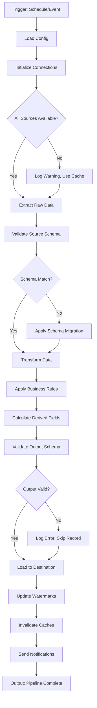

## Data Validation

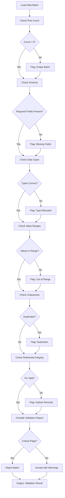

## Anomaly Detection

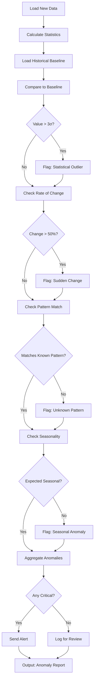

## Data Quality Scoring

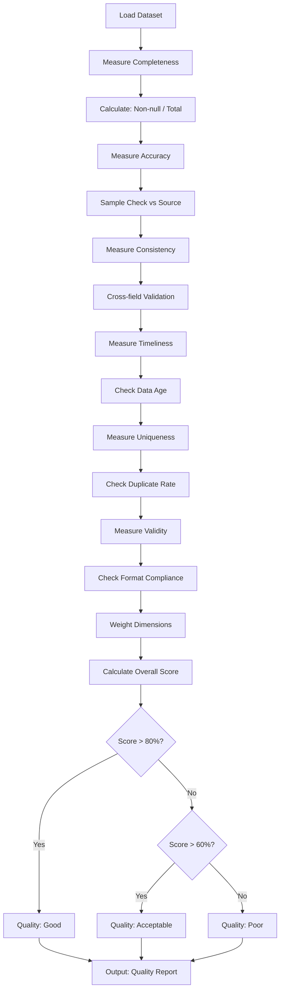

## Incremental Load

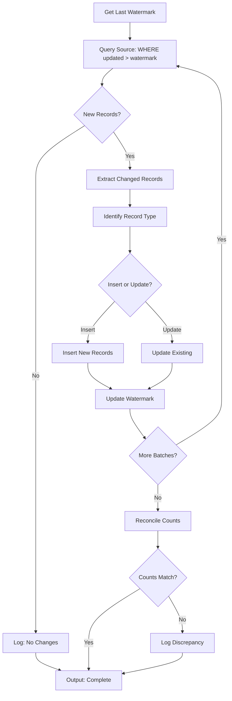

## Data Reconciliation

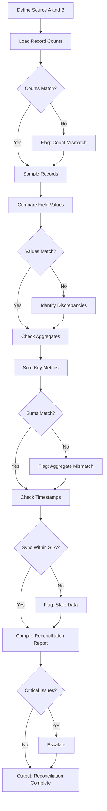

## Schema Evolution

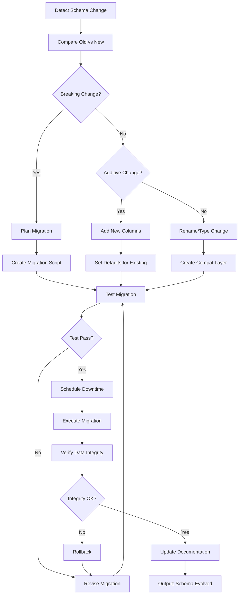

## Real-time Stream Processing

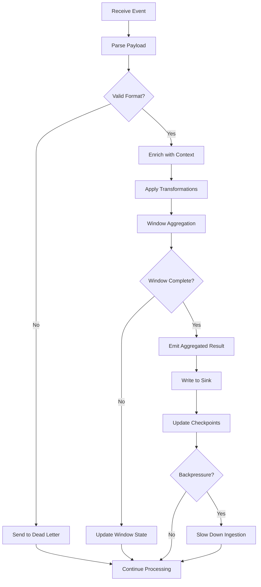

## Tweet Archive Gap Detection

Detects temporal gaps in tweet archives where data may be missing.
Maps to: `gap_detector.py::detect_gaps_for_account()` lines 41-152.

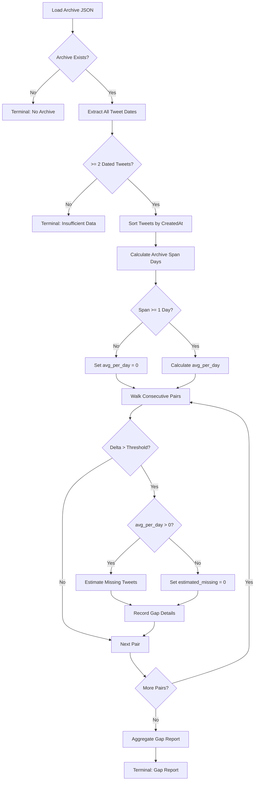

**Constraints:**
- **SPAN CHECK (Fix #10):** Never extrapolate avg_per_day from spans < 1 day - avoids inflated estimates
- **DATE RANGE (Fix #6):** Gap start must be before gap end
- **THRESHOLDS:** tokens/launchpads=48h, sire=24h, ai-feed=6h

## Tweet Backfill Execution

Executes backfill for a single entity account with all safety checks.
Maps to: `backfill.py::backfill_account()` lines 124-286.

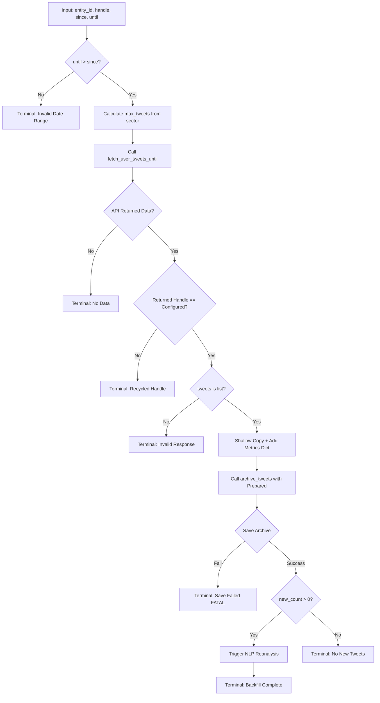

**Constraints:**
- **DATE VALIDATION (Fix #6):** until <= since is a terminal error
- **RECYCLED HANDLE (Fix #3):** Compare returned_handle.lower() != handle.lower() - abort if mismatch
- **NO DOUBLE-PROCESSING (Fix #2):** dict(tweet) shallow copy adds metrics without stripping entities/extendedEntities
- **TYPE CHECK (Fix #5):** isinstance(tweets, list) before iteration
- **FATAL SAVE (Fix #15):** Save failure halts processing
- **NLP TRIGGER (Fix #4):** Mandatory when new_count > 0

## Archive Health Assessment

Read-only validation of tweet archive structure and data integrity.
Maps to: `archive.py::validate_archive()` lines 693-770.

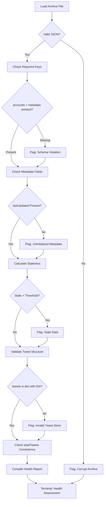

**Constraints:**
- **METADATA INIT (Fix #7):** Archives need lastUpdated, totalTweets, createdAt
- **SCHEMA (Fix #13):** Validate required keys before processing
- **HANDLE CHECK (Fix #3):** Verify account handles match config

## Usage Notes

1. **Idempotency** - Ensure pipelines can be re-run safely
2. **Watermarks** - Track what's been processed
3. **Dead letters** - Don't lose failed records
4. **Monitoring** - Alert on anomalies, not just failures
5. **Backfill strategy** - Plan for historical data loads
6. **Schema versioning** - Track and document changes
7. **Backfill idempotency** - archive_tweets() uses tweet_id dict keys for natural dedup
8. **NLP trigger** - Always run NLP reanalysis after backfill when new_count > 0
9. **Archive validation** - Run validate_archive() before reading archive data
