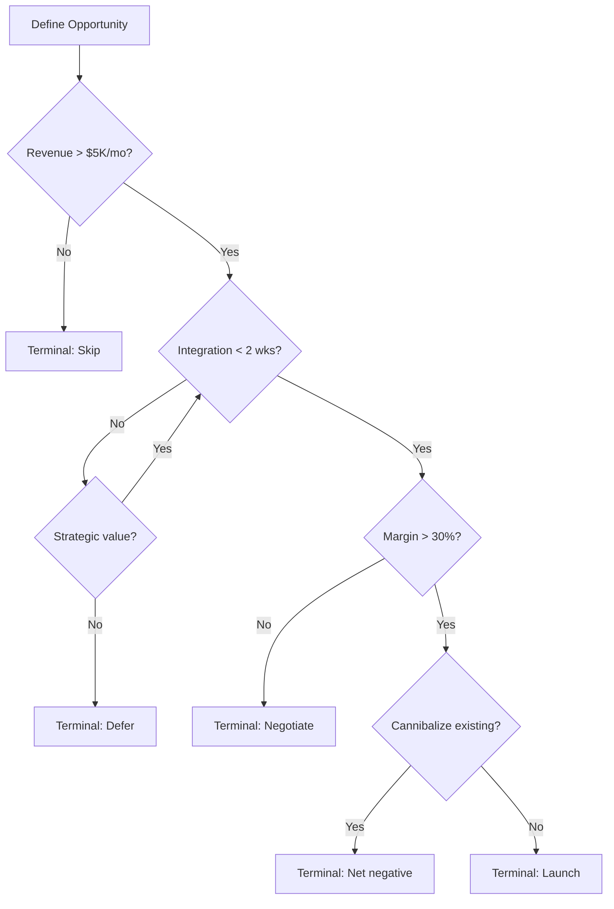

## DEEP EXPERT KNOWLEDGE

### The Reasoning Landscape: From Unbounded to Bounded

**Phase 1 -- Implicit Reasoning (pre-2022):** LLMs generated answers directly with reasoning implicit in hidden states. Kojima et al. (arXiv:2205.11916) discovered "Let's think step by step" unlocked zero-shot reasoning -- capability existed in weights but needed structural prompting.

**Phase 2 -- Chain-of-Thought (2022):** Wei et al. (arXiv:2201.11903) showed few-shot reasoning examples cause LLMs to produce intermediate steps. First breakthrough in making reasoning visible. But CoT is unbounded -- the model decides steps, order, and termination. Multi-step tasks drift.

**Phase 3 -- Structured Search (2023):** Yao et al. (arXiv:2305.10601) introduced Tree of Thoughts with BFS/DFS search. Besta et al. (arXiv:2308.09687) extended this to Graph of Thoughts with arbitrary graph structures. Better accuracy through exploration, but computationally expensive and drift persists within paths.

**Phase 4 -- Bounded Deterministic Reasoning (2025):** BRAID (arXiv:2512.15959) constrains reasoning to a pre-defined Mermaid flowchart executed node-by-node. Eliminates drift by construction. The "BRAID Parity Effect" proves structure can substitute for model capacity.

### Two-Stage Architecture

BRAID separates reasoning into two phases with different compute requirements:

**Stage 1 -- Architect Phase (Generate Once):** A capable model (or human) designs the Guided Reasoning Diagram (GRD). This is the expensive step, but it is amortized across many executions.

**Stage 2 -- Solver Phase (Execute Many):** A potentially cheaper model executes the diagram node-by-node. The GRD constrains the solver to bounded, deterministic reasoning. The BRAID paper showed GPT-5-nano with BRAID outperformed GPT-5-medium without it on SCALE MultiChallenge by 30x in Performance-per-Dollar.

```
┌─────────────────────────────────────────────────────────┐
│  ARCHITECT (Generate Once)  │  SOLVER (Execute Many)    │
├─────────────────────────────┼───────────────────────────┤
│  Claude Opus / GPT-5        │  Claude Haiku / GPT-5-nano│
│  High capability            │  Low cost                 │
│  Complex reasoning          │  Simple execution         │
│  $$$$ (amortized)           │  $ (per query)            │
└─────────────────────────────┴───────────────────────────┘
```

### Four Critical Design Principles

**1. Atomic Decomposition:** Each node performs ONE atomic operation. Compound nodes reintroduce drift.
```
BAD:  [Fetch data and calculate metrics and compare to peers]
GOOD: [Fetch Data] --> [Calculate Metrics] --> [Compare to Peers]
```

**2. Node Token Limit (<15 tokens):** Verbose nodes reintroduce noise. Smaller models lose adherence on nodes exceeding 15 tokens.
```
BAD:  [Calculate the annualized revenue by multiplying monthly by 12]
GOOD: [Annualize Revenue: x12]
```

**3. Explicit Decision Nodes with Feedback Edges:** All conditionals must be decision nodes (diamonds). Include feedback edges for revision paths to enable self-correction without leaving the graph.

**4. Terminal Clarity:** Every path must reach an unambiguous terminal node. No dangling branches.

### Diagram Functional Roles

**Procedural Scaffolds** (SCALE MultiChallenge, AdvancedIF): Strictly encode logic paths and constraint satisfaction to prevent reasoning drift. Each node is a checkpoint.

**Computational Templates** (GSM-Hard, Math): Use numerical masking -- dissociate specific values from structure. The diagram encodes the algorithm; the solver fills in the numbers.

**Decision Trees** (Business reasoning, architecture choices): Map the decision space exhaustively with explicit criteria at each branch point. Every terminal node is a clear recommendation.

### Bayesian Reasoning in BRAID

Bayesian reasoning maps naturally to BRAID: (1) Prior Node -- state base rate before evidence, (2) Evidence Node -- introduce updating evidence, (3) Posterior Node -- compute updated probability via Bayes' rule, (4) Decision Node -- compare posterior to action threshold. This prevents base rate neglect and availability bias by making the update explicit in the graph -- the model cannot skip the prior or ignore contradicting evidence.

### Constraint Satisfaction in BRAID

Multi-constraint problems (e.g., "find a channel that has >$5K/mo revenue, <2 weeks integration, >30% margin, and does not cannibalize existing channels") are naturally encoded as sequential constraint gates:



Each gate eliminates candidates early, preventing the reasoning from wasting compute on paths that violate hard constraints. This is directly analogous to constraint propagation in formal constraint satisfaction problems.

### Process Verification and Self-Consistency

Lightman et al. (arXiv:2305.20050) demonstrated that process supervision -- rewarding correct intermediate steps -- outperforms outcome supervision. BRAID's node-by-node execution trace is inherently a process supervision mechanism. Snell et al. (arXiv:2408.03314) showed that optimal test-time compute scaling can be more effective than scaling model parameters; BRAID enables this by identifying exactly where to invest additional reasoning (decision nodes and revision loops). Wang et al. (arXiv:2203.11171) introduced Self-Consistency -- majority voting over multiple reasoning paths. Combined with BRAID, self-consistency operates over structurally bounded paths, producing higher-quality candidates.

### Cognitive Bias Mitigation Framework

Every BRAID diagram should include bias-check nodes drawn from this taxonomy:

| Bias | Detection Question | BRAID Defense |
|------|-------------------|---------------|
| Anchoring | Is the first data point dominating the conclusion? | Randomize input order; add "ignore anchor" node |
| Confirmation | Am I only finding data that agrees? | Add mandatory "disconfirming evidence" node |
| Availability | Am I reasoning from one vivid example? | Add "base rate" node before case-specific reasoning |
| Sunk Cost | Would I make this decision if starting from zero? | Add "zero-based" decision node |
| Survivorship | Am I only analyzing successes? | Add "failure analysis" node |
| Status Quo | Am I defaulting to "keep things as they are"? | Add explicit "cost of inaction" node |
| Framing | Would a different framing change my conclusion? | Add "reframe" node with opposite presentation |
| Recency | Am I extrapolating from only recent data? | Add "historical context" node |
| Dunning-Kruger | Am I confident without deep domain knowledge? | Add "expertise check" node; flag LOW if outside domain |

### Execution Protocol

When executing a BRAID diagram:

1. **State Location:** Begin each step with `Node [ID]: [Label]`
2. **Single Action:** Perform ONLY that node's specified action
3. **Explicit Decisions:** At decision nodes, evaluate the condition explicitly, state the outcome, then declare which path
4. **No Invention:** Do NOT create nodes not in the diagram
5. **No Skipping:** Do NOT skip nodes, even if they seem redundant
6. **Loop Limits:** Maximum 3 iterations on any cycle, then force exit with explanation
7. **Terminal Required:** Must reach a terminal node; if stuck, explain why

### Reflexion and Self-Critique Integration

Shinn et al. (arXiv:2303.11366) introduced Reflexion -- verbal reinforcement learning through self-reflection on failures. BRAID incorporates this by adding a post-mortem node after terminal states: (1) execute GRD to terminal, (2) evaluate "Did the path produce a sound conclusion?", (3) if not, generate verbal critique and redesign the GRD, (4) re-execute with improved graph. This creates a meta-reasoning loop that improves GRD quality over time.

---

## Top 5 Experts in Structured LLM Reasoning

### 1. Amcalar & Cinar - OpenServ Labs, BRAID Authors
- **Specialty**: Bounded reasoning graphs, deterministic LLM inference, Mermaid diagram-driven reasoning
- **Credentials**: Authors of BRAID framework (arXiv:2512.15959); demonstrated +170% accuracy on SCALE MultiChallenge; proved "BRAID Parity Effect" - smaller models with BRAID match larger models without it
- **Sources**: arxiv.org/abs/2512.15959, openserv.ai
- **Apply**: Use BRAID GRDs for all complex multi-step analysis - protocol fundamentals, investment thesis, data extraction, risk assessment

### 2. Jason Wei - Google DeepMind, Chain-of-Thought Inventor
- **Specialty**: Chain-of-thought prompting, reasoning in LLMs, scaling laws for reasoning
- **Credentials**: Co-authored the original Chain-of-Thought paper (arXiv:2201.11903, 5000+ citations); led reasoning research at Google Brain/DeepMind
- **Sources**: jasonwei20.github.io, Google DeepMind publications
- **Apply**: Wei's CoT is the baseline BRAID improves upon - use standard CoT for simple reasoning, BRAID GRDs when drift/consistency matters

### 3. Shunyu Yao - Princeton, Tree of Thoughts & ReAct
- **Specialty**: Tree-structured reasoning, search-based problem solving, reasoning + acting in LLMs
- **Credentials**: Author of Tree of Thoughts (arXiv:2305.10601) and ReAct (arXiv:2210.03629); pioneered interleaving reasoning traces with tool actions
- **Sources**: arxiv.org/abs/2305.10601, arxiv.org/abs/2210.03629
- **Apply**: ToT explores multiple reasoning paths; BRAID constrains to one bounded path. ReAct combines reasoning with tool use; BRAID structures the reasoning component

### 4. Maciej Besta - ETH Zurich, Graph of Thoughts
- **Specialty**: Graph-based reasoning, distributed computing, LLM reasoning topologies
- **Credentials**: Author of Graph of Thoughts (arXiv:2308.09687, 500+ citations); introduced graph-based merge/refine reasoning for LLMs
- **Sources**: arxiv.org/abs/2308.09687, ETH Zurich publications
- **Apply**: GoT is BRAID's closest relative - GoT explores graph structures, BRAID constrains them. Use GoT insights for designing complex GRD topologies

### 5. Denny Zhou - Google DeepMind, Reasoning Research Lead
- **Specialty**: Self-consistency in CoT, least-to-most prompting, algorithmic reasoning
- **Credentials**: Led Google's reasoning research; co-authored self-consistency (arXiv:2203.11171) and least-to-most prompting papers
- **Sources**: Google DeepMind publications
- **Apply**: Zhou's self-consistency (sample multiple reasoning paths, take majority vote) can combine with BRAID - run the same GRD multiple times and verify consistency of outputs

---

## Research Foundations

| Paper | Authors | Year | Key Contribution | Application |
|-------|---------|------|-----------------|-------------|
| [BRAID](https://arxiv.org/abs/2512.15959) | Amcalar & Cinar (OpenServ) | 2025 | Mermaid GRDs, +170% accuracy, 74x PPD | Core framework - everything in this skill |
| [Adaptive GoT](https://arxiv.org/abs/2502.05078) | Extends Besta et al. | 2025 | Dynamic DAG decomposition at test time, +46.2% on GPQA | Future: auto-generate GRDs per query |
| [RL of Thoughts](https://arxiv.org/abs/2505.14140) | - | 2025 | RL navigator (<3K params) selects reasoning structure | Future: learn which GRD archetype per problem type |
| [Cascade Routing](https://arxiv.org/abs/2410.10347) | ETH Zurich | 2025 | Formal proof of optimal routing+cascading (ICML) | Theoretical foundation for Haiku→Sonnet cascade |
| [Graph of Thoughts](https://arxiv.org/abs/2308.09687) | Besta et al. (ETH Zurich) | 2023 | Graph-based reasoning with merge/refine | BRAID's closest relative - GoT explores, BRAID constrains |
| [Chain-of-Thought](https://arxiv.org/abs/2201.11903) | Wei et al. (Google) | 2022 | CoT prompting baseline (5000+ citations) | What BRAID improves upon |
| [braid-dspy](https://github.com/ziyacivan/braid-dspy) | Civan | 2025 | Official Python library | Reference: NumericalMasker, CriticExecutor, PPDAnalyzer |
