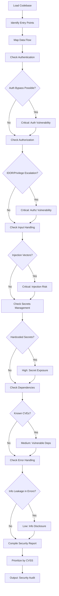
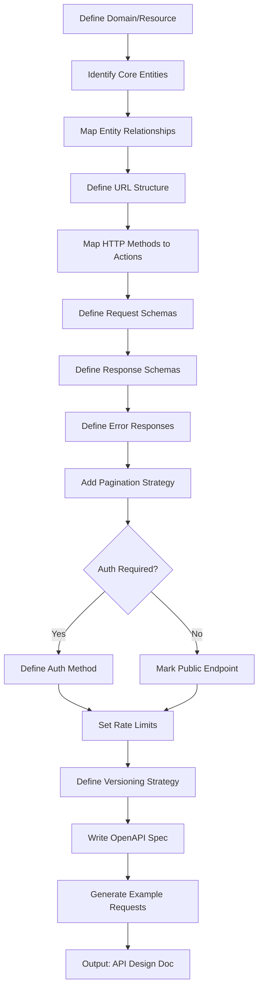
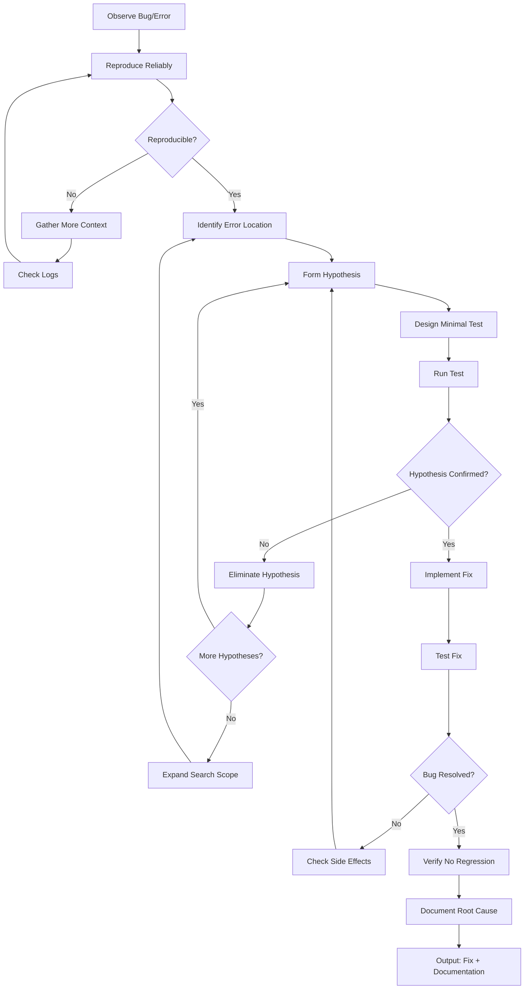
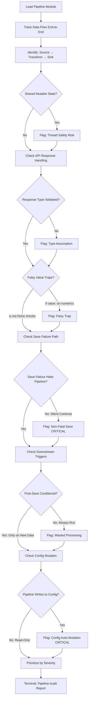
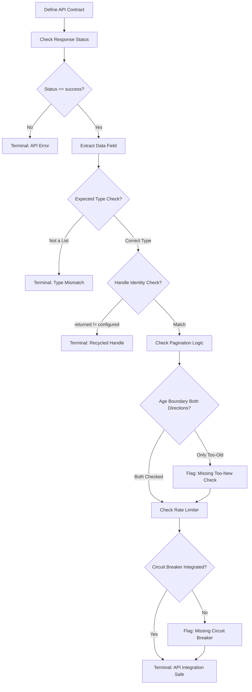
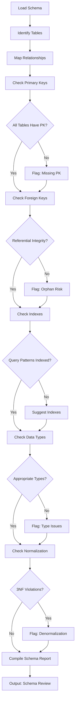
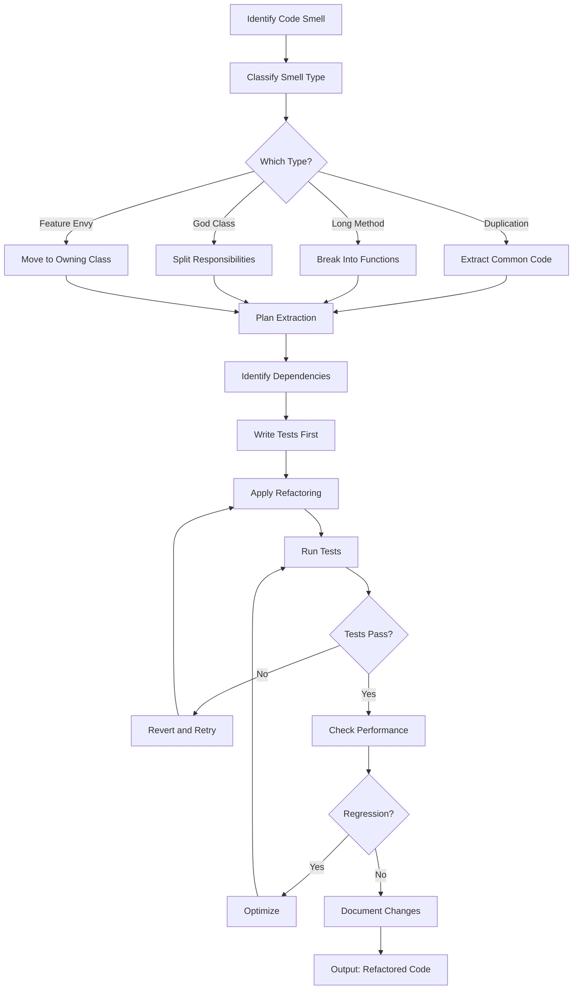
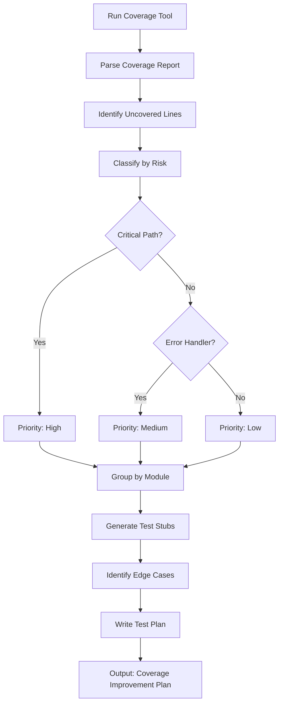
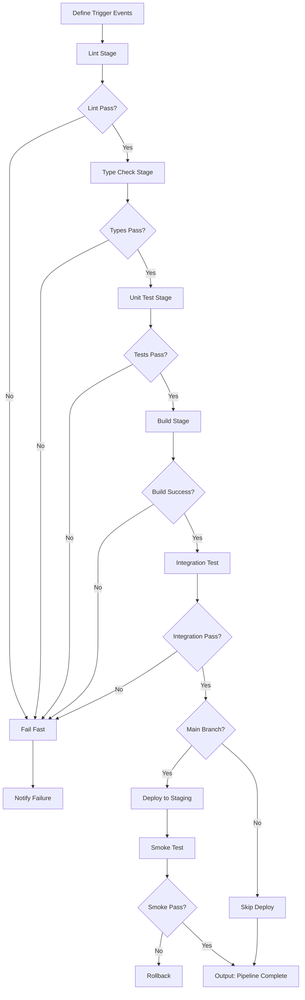

# Developer BRAID Templates

Code review, security audit, API design, and debugging scaffolds.

## Code Review

```mermaid
flowchart TD
    A[Load Code Diff/File] --> B[Parse AST/Structure]
    B --> C[Identify Changed Functions]
    C --> D[Check Type Safety]
    D --> E{Type Errors?}
    E -->|Yes| F[Log Type Issue: Critical]
    E -->|No| G[Check Error Handling]
    F --> G
    G --> H{Unhandled Exceptions?}
    H -->|Yes| I[Log Error Risk: High]
    H -->|No| J[Check Input Validation]
    I --> J
    J --> K{SQL/XSS/Injection Risk?}
    K -->|Yes| L[Log Security: Critical]
    K -->|No| M[Check Performance]
    L --> M
    M --> N{O(n²) or Worse?}
    N -->|Yes| O[Log Performance: Medium]
    N -->|No| P[Check Edge Cases]
    O --> P
    P --> Q{Null/Empty Handling?}
    Q -->|No| R[Log Edge Case: Low]
    Q -->|Yes| S[Check Test Coverage]
    R --> S
    S --> T[Aggregate Findings]
    T --> U[Sort by Severity]
    U --> V[Format Review Output]
```

## Security Audit



## API Design



## Debugging Workflow



## Data Pipeline Audit

Systematic audit of any data pipeline module for safety issues.
Encodes 14-fix audit lessons as bounded constraints.



**Constraints:**
- **DOUBLE-PROCESSING (Fix #2):** Trace data from API through every transform - check if strips break downstream
- **FALSY TRAPS (Meta-Principle #3):** `if value:` on 0, 0.0, "", [] is always wrong for pipeline data
- **NON-FATAL SAVE (Fix #15):** save_tweet_archive() returning False must halt, not continue
- **CONFIG MUTATION (Meta-Principle #4):** Pipelines NEVER write to config/entities.json
- **ALERT CONTEXT (Fix #8):** Every alert needs project_name + entity_id

## API Integration Safety

Validates API integration patterns for data pipeline safety.



**Constraints:**
- **WINDOW BOUNDARY (Fix #1):** Must handle BOTH too-new AND too-old tweets on mixed pages
- **TYPE CHECK (Fix #5):** isinstance(tweets, list) before iteration
- **RECYCLED HANDLE (Fix #3):** Compare returned vs configured handle
- **RETRY:** Use time-budget retry, not fixed-count retry

## Database Schema Review



## Refactoring Plan



## Test Coverage Analysis



## CI/CD Pipeline Design



## Usage Notes

1. **Start with failing tests** - Ensure bug exists before fixing
2. **One refactoring at a time** - Don't mix changes
3. **Security first** - Always check auth/authz before other issues
4. **Document assumptions** - Note what you're taking for granted
5. **Automate checks** - Convert findings into CI rules
