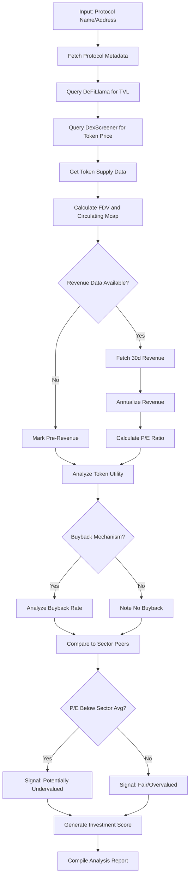
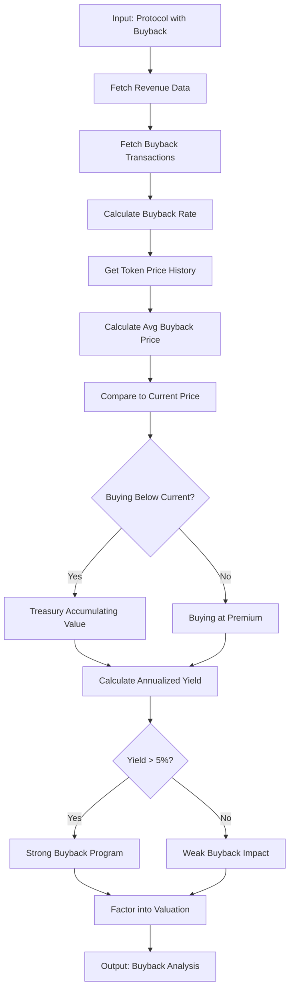
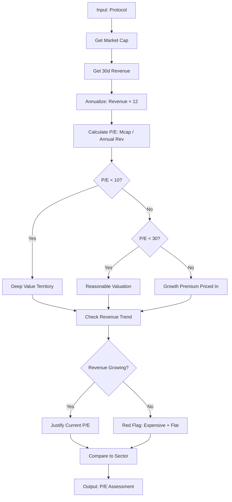
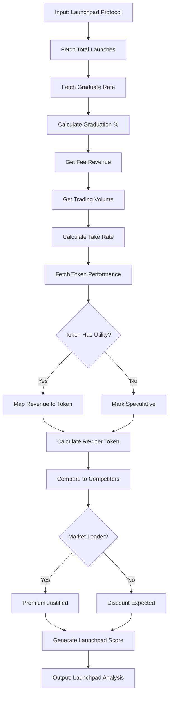
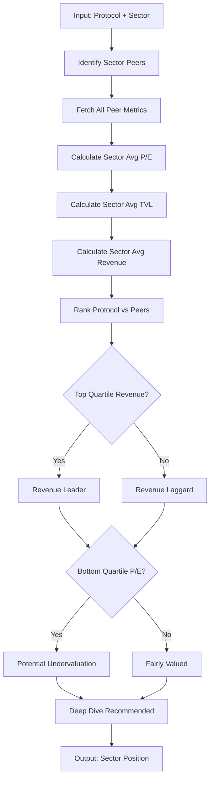
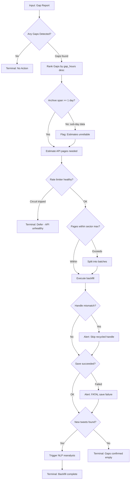
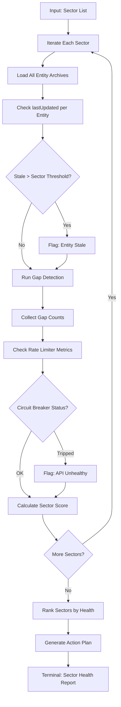
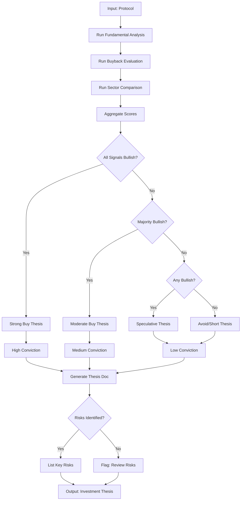
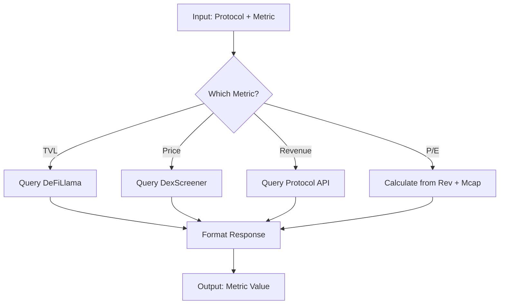
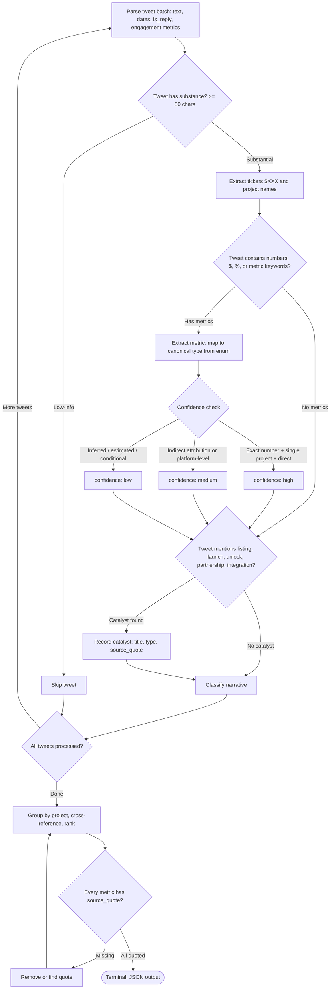

# ICM Analytics BRAID Templates

Protocol analysis templates tailored for Internet Capital Markets fundamental analysis.

## Protocol Fundamental Analysis

**Data Sources:**
- TVL: DeFiLlama API
- Price: DexScreener API
- Revenue: Protocol-specific (check docs)
- Supply: Token contract or CoinGecko

## Token Buyback Evaluation

## P/E Ratio Deep Dive

## Launchpad Analysis (Pump.Fun, Believe, etc.)

## Sector Comparison Matrix

## Backfill Decision Framework

Operational decision-making for gap-based backfill execution.
Maps to: `backfill.py::backfill_from_gaps()`, `gap_detector.py::detect_gaps_sector()`.

**Constraints:**
- **ESTIMATE RELIABILITY (Fix #10):** span_days < 1.0 → unreliable estimates
- **RATE LIMIT:** Check get_rate_limiter_metrics() before batch backfill
- **API COST:** ~$0.02/page × ceil(estimated_missing / 20)
- **NLP TRIGGER (Fix #4):** Always schedule NLP when new_count > 0
- **SECTOR MAX_PAGES:** tokens/launchpads=3 (60 tweets), sire=5 (100), ai-feed=160 (3200)

## Pipeline Sector Health

Cross-sector health monitoring for tweet pipeline operations.
Maps to: `scheduler.py::get_sector_status()`, `run_tweet_backfill.py`.

**Constraints:**
- **SECTOR ISOLATION:** Never mix data across sectors
- **STALENESS THRESHOLDS:** tokens/launchpads=24h, sire=12h, ai-feed=6h
- **ACTION PLAN:** "backfill with --since Xd", "investigate recycled handle", "restart cron"

## Investment Thesis Generator

## Quick Metrics Lookup

## Scout Extraction (Multi-Project Batch)

Production-tested GRD for extracting fundamentals across ALL projects in a scout's tweet batch.
Used by `scripts/braid_scout.py` - registered as `scout_extraction` in `shared/llm/cascade/grd.py`.

**Canonical Metric Types (19):**
`revenue, fees, tvl, volume, users, yield, market_cap, fdv, drawdown, growth, multiplier, unlock, funding, apy, p_e_ratio, inflows, transactions, price, other`

**Key Design Decisions:**
- Confidence calibration node prevents the "everything is high" trap
- Explicit catalyst extraction node prevents LLM from skipping non-numeric signals
- Post-processing normalization maps LLM free-text types to canonical types
- Feedback loop via `llm_feedback.py` injects corrections from previous runs

**Production Results (first run, 398 AIXBT tweets):**
- 85 projects, 156 metrics, ~$0.29 cost (Sonnet SDK), 100% source quote accuracy

---

## Usage Notes

1. **Always verify data sources** - APIs can lag or have errors
2. **Cross-reference metrics** - DeFiLlama TVL vs protocol-reported
3. **Note data freshness** - Include timestamp in analysis
4. **Flag missing data** - Don't estimate, mark as unavailable
5. **Compare apples to apples** - Same timeframes, same metrics
