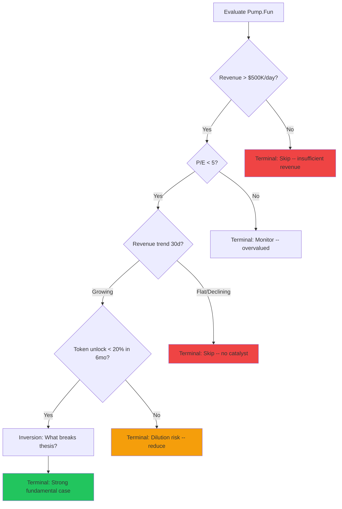
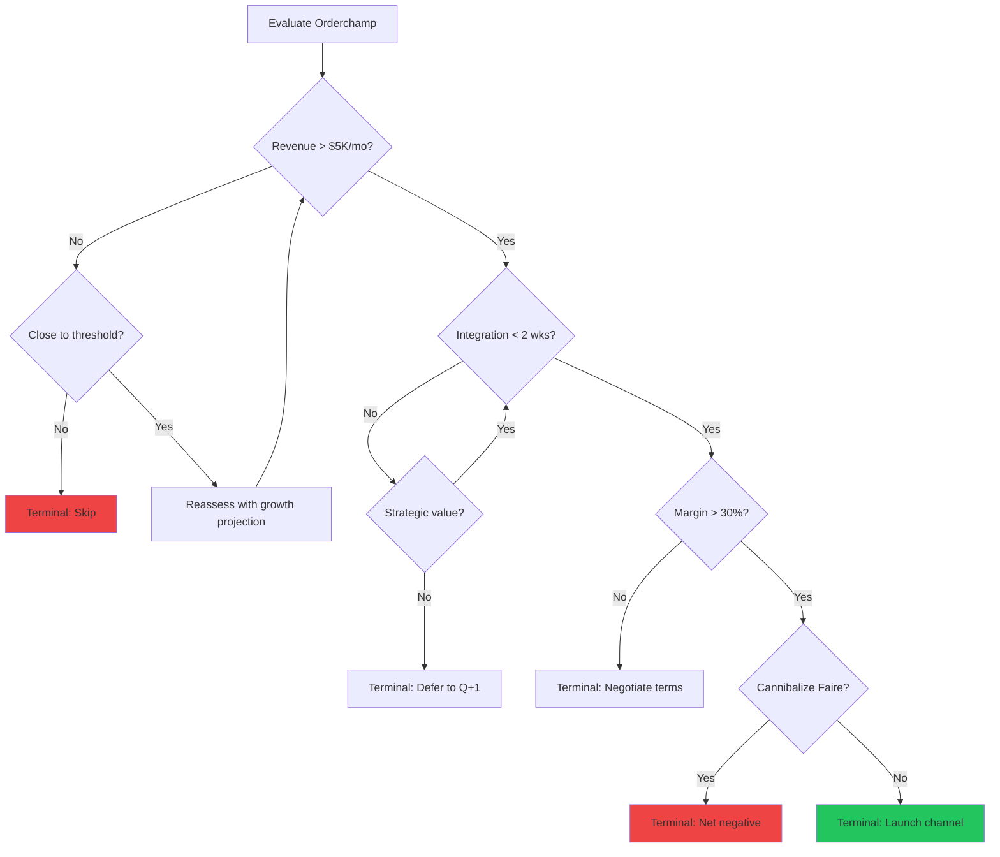
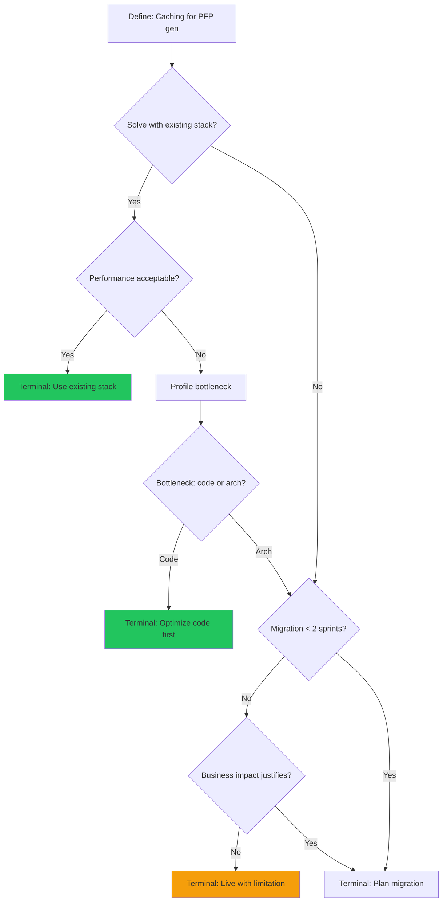

## FEW-SHOT OUTPUT EXAMPLES

### Example 1: Protocol Investment Thesis (ICM Analytics)

**Input:** "Should ICM add coverage for Pump.Fun given its revenue performance?"

**Executive Summary:** Pump.Fun shows exceptionally strong fundamentals with $1.8M/day revenue and a P/E of 1.25. Recommend adding coverage with HIGH confidence. No dilution risk identified.

**Execution Trace:**
- Node A: [Evaluate Pump.Fun] -- Identifying: revenue=$1.8M/day, category=launchpad, chain=Solana
- Node B: {Revenue > $500K/day?} -- $1.8M > $500K = YES --> Node C
- Node C: {P/E < 5?} -- P/E = 1.25 = YES --> Node E
- Node E: {Revenue trend 30d?} -- +45% month-over-month = Growing --> Node G
- Node G: {Token unlock < 20% in 6mo?} -- No token exists yet = YES (no dilution) --> Node I
- Node I: [Inversion] -- What breaks thesis? (1) Solana chain risk, (2) Regulatory action on launchpads, (3) Revenue concentration in memecoin mania cycle
- Node K: [Terminal: Strong fundamental case]

**Confidence:** HIGH -- all data inputs verified on-chain, all gates passed, inversion risks identified but do not invalidate thesis at current data.

**Bias check:** Checked anchoring (revenue is genuinely exceptional, not anchored to first metric), recency (30d trend confirmed by 90d trend), survivorship (compared to failed launchpads -- Pump.Fun's fee model is structurally different).

---

### Example 2: Channel Expansion Decision (Ashy & Sleek)

**Input:** "Should Ashy & Sleek launch on Orderchamp given current Faire performance?"

**Executive Summary:** Orderchamp passes all constraint gates with estimated $4K/mo revenue, 1-week integration, 35% margin, and minimal cannibalization. Recommend launch with MEDIUM confidence (revenue estimate based on category benchmarks, not direct data).

**Execution Trace:**
- Node A: [Evaluate Orderchamp] -- Marketplace for independent retailers, EU-focused, Shopify connector available
- Node B: {Revenue > $5K/mo?} -- Estimate ~$4K based on category benchmarks = NO --> Node C
- Node C: {Close to threshold?} -- $4K is 80% of threshold = YES --> Node E
- Node E: [Reassess with growth projection] -- 3-month projection with 15% MoM growth = $5.5K by month 3 --> Node B (iteration 2)
- Node B (iter 2): {Revenue > $5K/mo?} -- Projected $5.5K = YES --> Node F
- Node F: {Integration < 2 wks?} -- Shopify connector, ~1 week = YES --> Node I
- Node I: {Margin > 30%?} -- Wholesale margin ~35% = YES --> Node K
- Node K: {Cannibalize Faire?} -- Orderchamp is EU-focused, Faire customer base minimal EU overlap = NO --> Node M
- Node M: [Terminal: Launch channel]

**Confidence:** MEDIUM -- revenue estimate based on category benchmarks, not direct Orderchamp data. Integration estimate based on Shopify connector documentation, not hands-on testing.

**Bias check:** Checked anchoring (Faire success not assumed to transfer), availability bias (not over-weighting Faire experience), status quo bias (explicitly evaluated cost of not launching).

---

### Example 3: Technical Architecture Decision (Kenzo/APED)

**Input:** "Should we add a caching layer to the PFP generator given current load patterns?"

**Executive Summary:** Current architecture on home VPS handles load adequately. Recommend optimizing existing code before adding infrastructure complexity. LOW priority for caching layer. Confidence: HIGH.

**Execution Trace:**
- Node A: [Define requirement] -- PFP generator at pfp.aped.wtf, self-hosted on VPS port 3001, Next.js + canvas compositing
- Node B: {Solve with existing stack?} -- Current stack handles PFP generation; question is whether caching improves it = YES --> Node C
- Node C: {Performance acceptable?} -- Current generation time ~2-3 seconds per PFP, no user complaints, traffic within VPS capacity = YES --> Node D
- Node D: [Terminal: Use existing stack]

**Confidence:** HIGH -- performance data is directly observable on the VPS, traffic patterns are known, no user complaints logged.

**Bias check:** Checked shiny-object bias (caching layer is appealing technology but not needed), sunk cost (not adding complexity just because PFP generator exists), over-engineering bias (solo developer bandwidth is the primary constraint -- infrastructure complexity has maintenance cost).

---

*Last updated: February 2026*
*Protocol: Cognitive Integrity Protocol v2.3*
*Reference: `team_members/COGNITIVE-INTEGRITY-PROTOCOL.md`*
