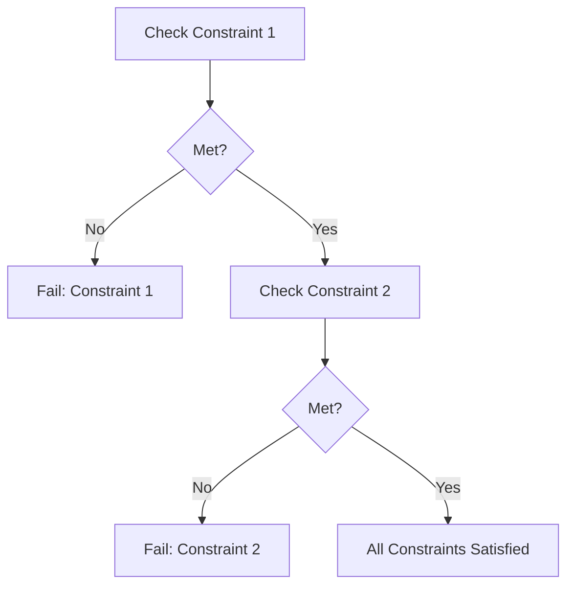
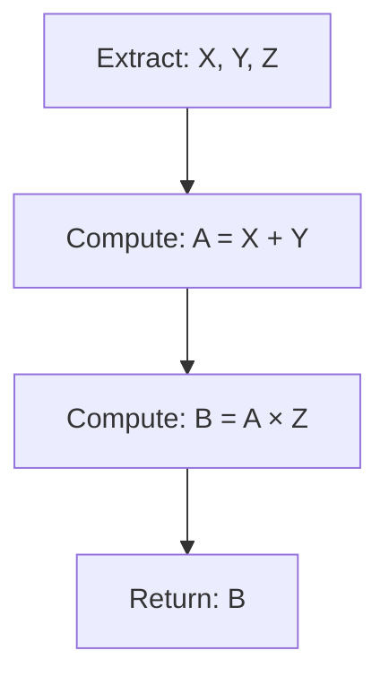
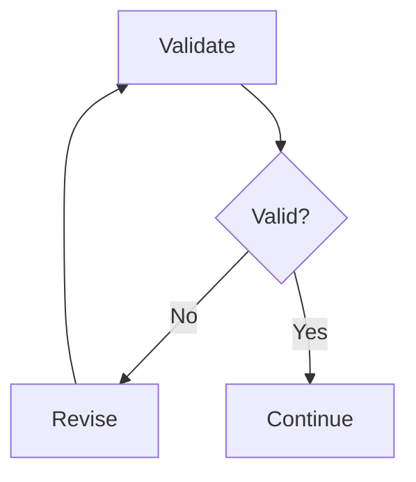
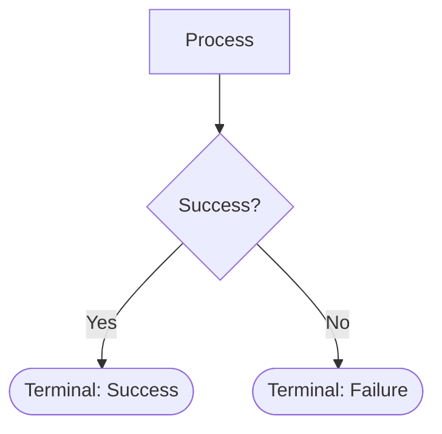

# BRAID Theory & Research Findings

Detailed reference from arXiv:2512.15959 and related research.

## The Problem BRAID Solves

### Reasoning Drift in LLMs

Large language models exhibit problematic behaviors in complex tasks:

1. **Constraint Forgetting** - In multi-turn conversations, models lose track of constraints from earlier turns
2. **Logic Contradiction** - Models contradict their own earlier reasoning steps
3. **Token Drift** - Unbounded text generation allows the model to "wander" off-topic
4. **Hallucination Amplification** - Free-form reasoning provides opportunities for hallucinations to compound

Research supports this:
- MIT (2024): "Reasoning skills of LLMs are often overestimated" - they excel at pattern-matching familiar problems but fail on novel ones
- Nature (2024): "Larger, more instructable models actually become less reliable, amplifying biases and inconsistencies in reasoning"
- Apple ML Research (2024): "The Illusion of Thinking" - reasoning models hit a wall on complex problems, with accuracy collapsing despite extra compute

### Why Scale Isn't Enough

The prevailing assumption: more parameters = better reasoning. Reality:

```
ASSUMPTION:  Reasoning ∝ Model Size
REALITY:     Reasoning = Model Capacity × Prompt Structure

IMPLICATION: By increasing structure, we can decrease required capacity
```

## BRAID's Core Innovation

### Guided Reasoning Diagrams (GRDs)

BRAID replaces natural-language Chain-of-Thought with machine-readable flowcharts:

```
Chain-of-Thought:
"Let me think about this step by step. First, I should consider...
actually, wait, let me reconsider... on second thought..."
→ Unbounded, driftable, hard to audit

BRAID:
flowchart TD
    A[Step 1] --> B{Check} --> C[Step 2] --> D[Output]
→ Bounded, deterministic, auditable
```

### The Two-Phase Architecture

**Phase 1: Generation (Planning)**
- Model analyzes problem
- Produces explicit reasoning structure as Mermaid diagram
- This is the "cognitive architecture" phase
- Can use powerful model (cost amortized)

**Phase 2: Execution (Solving)**
- Model follows the diagram strictly
- Each node is executed atomically
- No deviation from the graph
- Can use cheaper model

### Why This Works

1. **Externalized Working Memory** - The diagram holds the reasoning structure, freeing the model to focus on atomic operations
2. **Forced Precision** - Diamond nodes require explicit boolean evaluation
3. **Deterministic Paths** - Once drawn, the diagram constrains all possible execution flows
4. **Auditability** - Every step is visible; failures can be traced to specific nodes

## Benchmark Results Deep Dive

### SCALE MultiChallenge

**Task:** Multi-turn conversations with constraint satisfaction across 4 types of information from previous messages.

**Results:**
| Configuration | Accuracy | PPD |
|--------------|----------|-----|
| GPT-4o Classic | 19.9% | baseline |
| GPT-4o BRAID | 53.7% | +170% |
| GPT-5-nano-medium BRAID | 57.0% | 30.31x |
| GPT-5-medium Classic | 63.0% | 1.0x |

**Why BRAID excels here:** The benchmark's multi-turn constraints induce reasoning drift in traditional prompting. BRAID's graph structure serves as a "procedural scaffold," explicitly encoding each constraint as a node.

### GSM-Hard

**Task:** Grade-school math word problems (harder variants).

**Results:**
| Configuration | Accuracy |
|--------------|----------|
| GPT-4o Classic | 42% |
| GPT-4o BRAID | 91% |
| GPT-5-nano BRAID | 94-98% |

**Key insight:** Models are already saturated on math capability, but BRAID provides massive efficiency gains (up to 74x PPD). The diagram acts as a "computational template" - separating algorithm planning from execution.

### AdvancedIF (Instruction Following)

**Results:**
- Similar pattern: accuracy gains + massive PPD improvements
- GPT-5-medium → GPT-5-nano-minimal yields 61.69 PPD
- Diagrams encode instructions explicitly, preventing drift

## The BRAID Parity Effect

The paper's most significant finding:

> "A smaller model equipped with bounded reasoning (BRAID) often matches or exceeds the performance of a model one or two tiers larger using unstructured prompting."

**Example:** On SCALE MultiChallenge:
- GPT-5-nano-medium (BRAID) outperformed GPT-5-medium (Classic) by 30.31x in PPD
- While achieving 57% vs 63% accuracy (close parity)

**Implication:** Reasoning performance is NOT strictly a function of parameter count. It's a product of model capability AND prompt structure.

## Functional Roles of BRAID Diagrams

The paper identifies two distinct roles:

### 1. Procedural Scaffolds

**Used in:** SCALE MultiChallenge, AdvancedIF

**Function:** Strictly encode logic paths and constraint satisfaction to prevent reasoning drift.



### 2. Computational Templates

**Used in:** GSM-Hard, math problems

**Function:** Use numerical masking to separate algorithm from values.



The solver fills in actual numbers; the template defines the computation.

## Four Critical Design Principles

From empirical evaluation:

### 1. Atomic Decomposition

Each node must perform exactly ONE operation.

**Bad:** `[Fetch data, validate schema, and transform]`
**Good:** `[Fetch Data]` → `[Validate Schema]` → `[Transform]`

**Why:** Compound nodes reintroduce the ambiguity that causes drift.

### 2. Token Brevity (<15 tokens per node)

Nodes with fewer than 15 tokens yield highest adherence in Nano-tier models.

**Bad:** `[Calculate the protocol's annualized revenue by multiplying monthly revenue by twelve]`
**Good:** `[Annualize: Rev × 12]`

**Why:** Verbose nodes reintroduce the noise of unbounded natural language.

### 3. Explicit Conditionals with Feedback

All conditionals must be decision diamonds. Include feedback edges:



**Why:** This creates bounded cycles for self-correction without unbounded loops.

### 4. Terminal Clarity

Every path must terminate clearly. No prohibited keywords should reach the End node without passing constraint checks.



## Economic Analysis

### Performance-per-Dollar (PPD) Metric

```
PPD = (Accuracy / Cost) / (Baseline Accuracy / Baseline Cost)

Where baseline = GPT-5-medium classic prompting = 1.0
```

PPD > 1 = more efficient than baseline
PPD < 1 = less efficient than baseline

### The Golden Quadrant

Highest efficiency achieved by:
- **Generator:** High-capability model (GPT-5-medium, Claude Opus)
- **Solver:** Low-cost model (GPT-5-nano, Claude Haiku)

```
Generator Cost: Amortized over many executions
Solver Cost: Dominates in continuous workflows

Total Cost ≈ Solver Cost × Executions (for large N)
```

### Hard Economic Limit for Large Solvers

Regardless of generator, combinations with large model solvers flatline at PPD ≈ 1.0-2.5.

**Why:** The token overhead of ingesting the BRAID diagram makes high-tier models economically inefficient for execution.

**Conclusion:** Massive efficiency gains are structurally inaccessible to monolithic deployments. They require transitioning execution to nano/mini tier.

## Limitations and Future Work

### Known Limitations

1. **Structural Brittleness** - A flawed reasoning graph leads directly to failure; solver lacks natural-language self-correction
2. **Generation Cost** - For one-shot tasks, generation overhead may not be justified
3. **Domain Specificity** - Optimal diagram patterns vary by task type

### Future Directions (from paper)

1. **Specialized Architect Models** - Fine-tune small models solely for BRAID generation
2. **Open-Source Validation** - Test across LLaMA, Mistral, Qwen to verify Parity Effect
3. **Dynamic Self-Correction** - Execution loops where solvers detect "Topology Errors" and trigger localized graph regeneration
4. **Coding Benchmarks** - Extend evaluation to programming tasks

## Integration Patterns

### For Agentic Systems

```python
# Pre-compute diagrams for known task types
TASK_DIAGRAMS = {
    "protocol_analysis": load_diagram("protocol.mmd"),
    "code_review": load_diagram("review.mmd"),
    ...
}

# Agent execution
def execute_task(task_type, inputs):
    diagram = TASK_DIAGRAMS[task_type]
    return solver.execute(diagram, inputs)
```

### For Production Deployments

1. **Catalog diagrams** by task type
2. **Version control** diagrams like code
3. **A/B test** diagram variants
4. **Monitor** node-level execution traces
5. **Iterate** based on failure patterns

## Citations

```
@article{amcalar2025braid,
  title={BRAID: Bounded Reasoning for Autonomous Inference and Decisions},
  author={Amcalar, Armağan and Cinar, Eyup},
  journal={arXiv preprint arXiv:2512.15959},
  year={2025}
}
```

Related Research:
- Kojima et al. (2022) - Zero-Shot Chain of Thought
- Yao et al. (2023) - Tree of Thoughts
- Wei et al. (2022) - Chain-of-Thought Prompting
- Sirdeshmukh et al. (2025) - SCALE MultiChallenge
- Huang et al. (2025) - AdvancedIF
